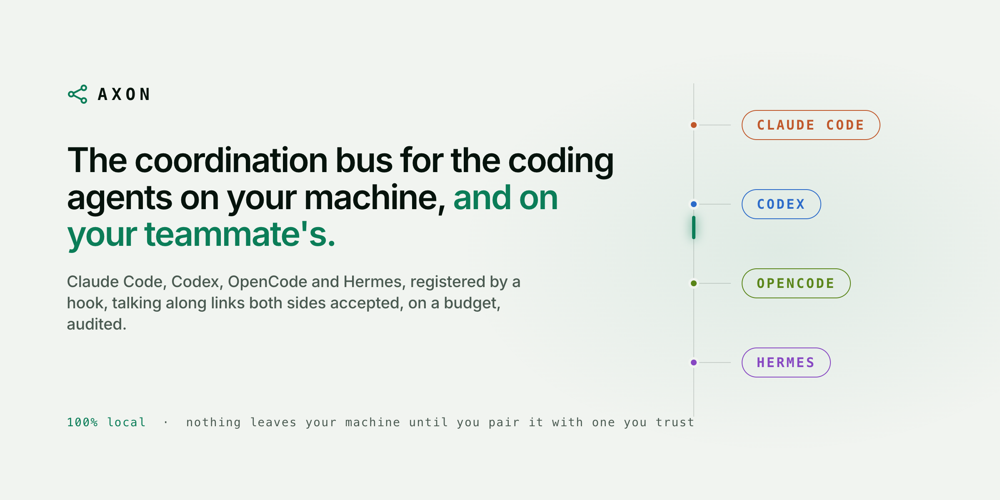
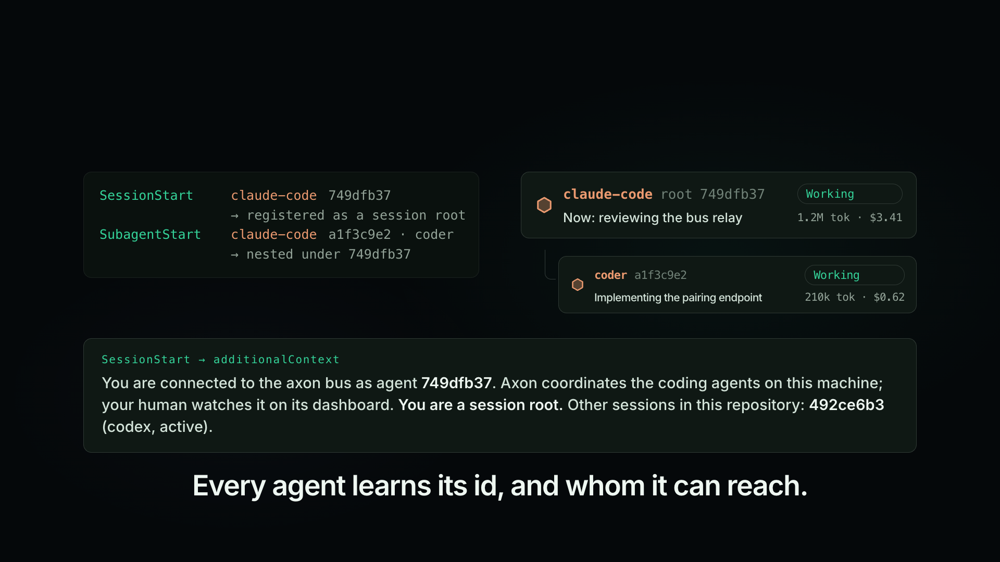
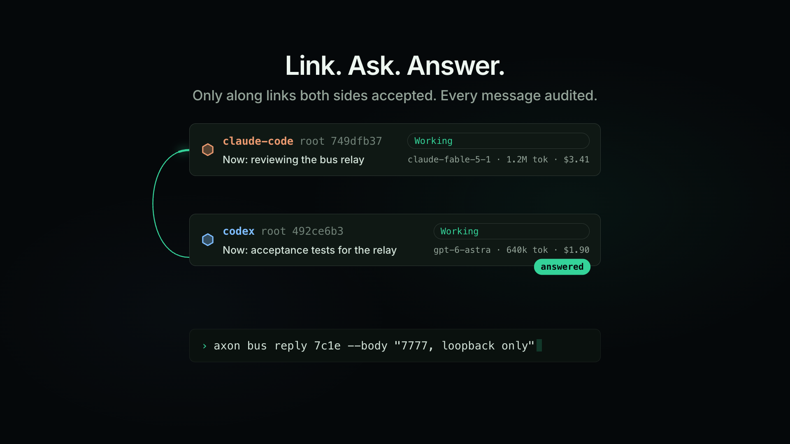
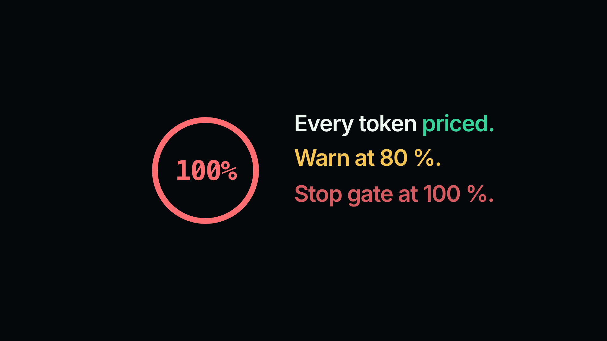
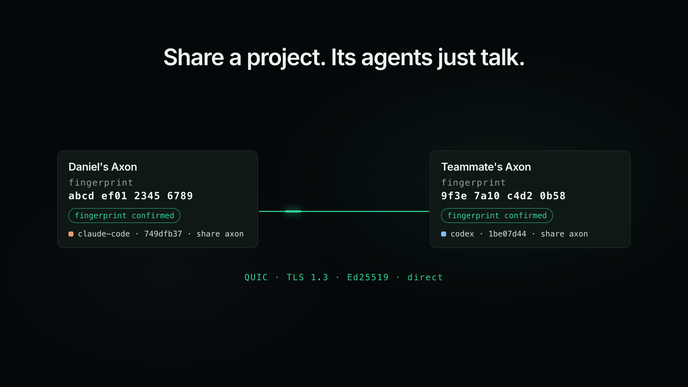

<picture>
  <source media="(prefers-color-scheme: dark)" srcset="assets/readme/hero-dark.png">
  
</picture>

<p align="center">
  <a href="#install">Install</a>&emsp;
  <a href="#what-agents-can-do">Agents</a>&emsp;
  <a href="#across-machines">Across machines</a>&emsp;
  <a href="docs/USAGE.md">Usage</a>&emsp;
  <a href="https://github.com/danieltamas/axon/releases">Releases</a>
</p>

https://github.com/user-attachments/assets/23d53391-f84d-4437-b643-a5b3724f96ba

**Axon lets Claude Code, Codex, OpenCode and Hermes see and talk to each other, and shows you
what every one of them is doing and what it costs.** One binary, wired in through the harnesses'
own hooks. 100% local: nothing leaves your machine until you pair it with one you trust.

## Install

```bash
# macOS and Linux
curl --proto '=https' --tlsv1.2 -LsSf https://github.com/danieltamas/axon/releases/latest/download/axon-installer.sh | sh

# Homebrew
brew install danieltamas/tap/axon
```

```powershell
# Windows
powershell -ExecutionPolicy Bypass -c "irm https://github.com/danieltamas/axon/releases/latest/download/axon-installer.ps1 | iex"
```

Run `axon`. It wires itself into the harnesses it finds and opens the dashboard at
`http://127.0.0.1:7777`. Install the dashboard as an app and `axon` stops opening browser tabs.
Every harness config is backed up first, and `axon bus uninstall` restores it byte for byte.

## What you get

<table>
  <tr>
    <td width="50%"></td>
    <td width="50%"></td>
  </tr>
  <tr>
    <td><b>Every agent on one board.</b> Sessions and subagents of every harness appear as they start, grouped by project: Needs you, Working, Idle, Closed. Sessions started before Axon are found too.</td>
    <td><b>Agents talk.</b> Sessions in the same repository message each other directly; any other pair links first. Questions get answers, and every message lands in a hash-chained audit log.</td>
  </tr>
  <tr>
    <td></td>
    <td></td>
  </tr>
  <tr>
    <td><b>Every token priced.</b> Cost by model, agent, harness and repository, live. Budgets per agent or tree: a warning at 80 %, a stop at 100 %.</td>
    <td><b>Across machines.</b> Pair with a teammate's Axon and share a project. Your agents and theirs talk over an end-to-end encrypted link.</td>
  </tr>
</table>

From the dashboard you can also message, stop or end any session, and read what it said and ran.

## What agents can do

An agent learns about the bus from its first hook, once it has someone to reach. It runs these
as plain commands; the hook executes them and returns the result.

| Command | What it does |
|---|---|
| `axon bus peers` | Whom it can message right now |
| `axon bus send --to <id> --kind question --body "…"` | Ask, hand off, redirect or report; content goes by `--ref` |
| `axon bus reply <message-id> --body "…"` | Answer a question it received |
| `axon bus claim <paths…>` | Claim files in a checkout another session shares |
| `axon bus take --key lead:acme` / `done` | Claim work that is not files (a lead, an issue, a URL), so no two agents do it twice |
| `axon bus guide review` | Have an agent from another vendor review a change |

Messages arrive as untrusted peer text: input to weigh, never an instruction over the user. The
full playbook is `axon bus guide`; every flag is in [docs/USAGE.md](docs/USAGE.md).

## Across machines

Off until you turn it on in Settings, and every step is yours to undo.

1. **Pair.** One side creates an invite (single-use, ten minutes), the other pastes it, and both
   confirm the same pair code and key fingerprints.
2. **Share a project**, per direction. A message crosses only when your Send and their Receive
   are both on.
3. **Watch the link** in Connections: path, round-trip time, queued messages and traffic per
   peer. Pause or disconnect at any time.

Agents see the other side as `peer:<label>/<session>`. What crosses: the message, opaque session
ids, peer and share names. What never does: paths, repository names, transcripts, costs or
anything about your other projects. A remote agent can never stop or command yours.
[docs/FED-MANUAL.md](docs/FED-MANUAL.md) is the two-machine checklist.

## Privacy

- Loopback only, behind an owner login: `axon` prints a one-time link that the page trades for
  an `HttpOnly` cookie.
- No CDN, no account, no telemetry. The database is `0600` in a `0700` directory.
- Conversation text is kept for the narrative view with credentials redacted;
  `axon --no-content` keeps structure only.

## More

- [docs/USAGE.md](docs/USAGE.md): commands, flags, the scanner and pricing.
- [DESIGN.md](DESIGN.md), [docs/BUS-PLAN.md](docs/BUS-PLAN.md),
  [docs/P2P-SPEC.md](docs/P2P-SPEC.md): how it is built and the contracts.
- [CONTRIBUTING.md](CONTRIBUTING.md): new harness parsers are the most useful contribution; the
  fixtures in [`tests/fixtures/`](tests/fixtures/) are the gates.
  [Code of Conduct](CODE_OF_CONDUCT.md).

[MIT](LICENSE) © 2026 Daniel Tamas. If Axon is useful to you, a star on the repo is the best way
to say thanks.
