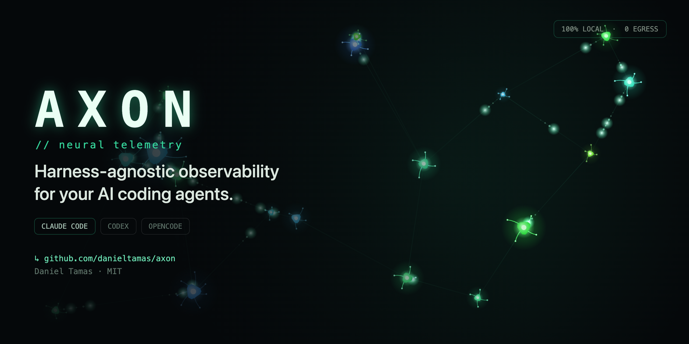

<p align="center">
  
</p>

# Axon

**See every AI coding agent on your machine, what it costs, and steer it, from one local dashboard.**

[](./LICENSE)
[](#roadmap)
[](https://www.rust-lang.org)

Axon reads the logs your coding-agent harnesses already write (Claude Code, Codex, OpenCode,
Hermes) and wires itself into their hooks. One `axon` binary then shows which sessions and
subagents are running in which project, what each one is doing and costs, and lets you message,
budget, stop or end them.

**100% local. No account. Nothing leaves your machine.**

## What it does

| Capability | |
|---|---|
| **Live topology**: every project, its sessions grouped as Needs you / Working / Idle / Closed, subagents beside their session, a 24 h activity chart | ✅ |
| **Observed sessions**: harness processes started before Axon are found from the process table, with transcript narrative ("Now / Said / Ran"), model, tokens, cost and memory | ✅ |
| **End sessions**: end one idle session from its card or every idle one in a project; two-click confirm, re-checked by the server | ✅ |
| **Messages between agents**: each agent is told its bus id, whom it can reach and which sessions in its repo it could link with; `send` / `reply` along edges, root-to-root `link` / `accept`, per-thread `grant`, `peers`, operator messages from the dashboard. An agent's bus commands run through its hook, so they work inside a sandbox | ✅ |
| **Budgets and stops**: token and USD ceilings per tree or agent; warn at 80 %, a stop gate at 100 % | ✅ |
| **Cross-harness cost**: exact per-subagent attribution, per model / agent / harness, today / week / month spend with budget alerts | ✅ |
| **Coordination**: path `claim`s in a checkout, task routing from `routes.toml` | ✅ |
| **Audit and replay**: hash-chained audit log, replay of a JSONL transcript corpus | ✅ |
| **Usage brain**: a live view of models firing, sized by spend | ✅ |
| **RTK**: Rust Token Killer's token savings, if installed | ✅ |
| **Desktop app**: install the dashboard as an app from the browser; when `axon` is not running it shows how to start it and comes back by itself | ✅ |
| **Settings page**: capture and retention, usage retention, budgets, hook install state, database size and compact, the federation switch and its Peers panel, all from the dashboard | ✅ |
| **Working across machines**: pair your Axon with a teammate's, share a project, and the agents in it message each other over an encrypted peer-to-peer link; live connection health, pause, resume or disconnect from Settings ([guide](#working-across-machines)) | ✅ |
| Shareable cards, OTEL export | planned |

## Install

```bash
# macOS and Linux
curl --proto '=https' --tlsv1.2 -LsSf https://github.com/danieltamas/axon/releases/latest/download/axon-installer.sh | sh

# Homebrew
brew install danieltamas/tap/axon
```

```powershell
# Windows
powershell -ExecutionPolicy Bypass -c "irm https://github.com/danieltamas/axon/releases/latest/download/axon-installer.ps1 | iex"
```

Each [release](https://github.com/danieltamas/axon/releases) also carries plain archives and
checksums for macOS (Apple Silicon, Intel), Linux (x86_64, arm64; static musl) and Windows.
From source, with [Rust](https://rustup.rs): `cargo install --path .` in a clone.

The first run wires Axon into the harnesses it finds: hooks in their own configs that run this
`axon`, which is what makes messages, budgets and stops work. Each config is backed up first;
`axon bus uninstall` restores it byte for byte, and `axon --no-hooks` leaves them alone. If you
move or reinstall `axon`, the hooks are repointed on its next run.

> [!NOTE]
> **Upgrading from 0.2.x** moves Axon's usage rows to a new table and re-reads your logs once on
> the first start (in the background; the dashboard is up immediately). The migration is
> one-way: don't run 0.2.x against the database afterwards.

## Usage

```bash
axon                      # serves http://127.0.0.1:7777 and opens it
axon --port 8080 --no-open
axon --no-content         # structure only: turns, tokens and tool names, never text
axon --scan-only          # headless: scan the logs, print a JSON summary, exit

axon open --print         # a fresh dashboard login link
axon bus --help           # the control plane: send, ask, budget, claim, audit, doctor…
axon bus budget set <agent-id> 2Mtok --usd 20  # a registered agent (its tree's root)
axon bus doctor           # which harnesses are wired
axon bus guide            # the playbook every agent is pointed to
```

Axon scans `~/.claude/projects/`, `~/.codex/sessions/`, OpenCode's `opencode.db` and
ccflare-family proxy databases. Only logs that changed since the last scan are read again, so
a restart and the live refresh stay fast however much history you have. Budget caps live in
`~/.config/axon/config.toml` (see [`assets/config.example.toml`](./assets/config.example.toml)).

`axon --scan-only` prints totals plus per-model, per-agent and per-harness breakdowns:

```jsonc
{
  "events": 38483,
  "sessions": 206,
  "tokens_out": 36320161,
  "cost_eur": 8187.32,                    // computed from pricing.toml (USD rates × fx)
  "unpriced_models": ["gpt-5.4"],        // models missing from the map: cost is a floor
  "today_cost_eur": 409.96,
  "by_harness": [
    { "harness": "claude-code", "cost_eur": 6963.44 },
    { "harness": "codex",       "cost_eur": 1215.15 },
    { "harness": "opencode",    "cost_eur": 8.73 }
  ]
}
```

Rates are USD from each provider's docs, converted via `fx_to_display` in
[`crates/axon-core/assets/pricing.toml`](./crates/axon-core/assets/pricing.toml) (override at
`~/.config/axon/pricing.toml`). A model missing from the map is flagged **unpriced** rather than
counted as free; local models are free; OpenCode's own per-message cost is used directly.

## Working across machines

Two people can let the agents in one project talk to each other, each on their own machine.
It is off until you turn it on, grants nothing when you pair, and every step is yours to
undo.

1. **Turn it on.** Settings, Federation, switch on. Nothing listens or dials before that.
   Connections go direct when they can and through a relay when they cannot (a relay sees
   only encrypted traffic); the Relay field takes your own `https://` relay.
2. **Pair.** In Settings, Federation, one of you chooses Invite a machine: an `axon1:`
   link appears (valid 10 minutes, one at a time, with a countdown, a Copy button and Cancel
   invite). Send it over any channel. The other pastes it under Join with an invite, adds a
   name for the inviter, and chooses Join; a refusal is explained under the field. Both
   Axons then show the same 24 digits, the pair code, and the two key fingerprints. Compare
   the code out loud or in a chat you already trust, choose Confirm, it matches on both
   sides within 10 minutes, or Reject. A wrong code removes the pairing. The same steps
   are available over the local API: sign in with `axon open --print`, `POST /api/session`
   `{"nonce":"<from the link>"}` answers `{"token":"…"}` and sets the cookie, and every call
   then needs both (`Cookie: axon_session=…` and `x-axon-session: <token>`), a matching
   `Origin` and, on POST and PUT, `Content-Type: application/json`. The routes:
   `PUT /api/settings/federation {"enabled":true}`, `POST /api/fed/invites {}`,
   `POST /api/fed/join {"invite","label"}`, `POST /api/fed/peers/<id>/confirm {"pair_code"}`
   and `GET /api/fed` (see `crates/axon-bus/tests/acceptance_fed_pairing.rs` and
   `acceptance_fed_auth.rs`).
3. **Share a project, in each direction.** Pairing shares nothing. On a peer's card, Share a
   project: pick one of your projects (or enter a folder), choose Send and Receive, and offer
   it. The other side sees the offer, picks their own checkout and flags, and accepts. A
   message from A to B crosses only when A's Send and B's Receive are both on; a note under
   each switch says when the other side has not agreed yet. Each owner can flip their own
   switches or Unshare (asks first) at any time. Only agents working in the shared repository
   can send or receive, worktrees included.
4. **Pause, resume, disconnect.** In Settings, each peer has Pause (nothing is sent or
   delivered, the link stays paired), Resume, and Disconnect, which asks first: it ends every
   share, cancels what is queued, deletes remote messages no agent has seen, and forgets the
   peer. Pairing again starts from nothing.
5. **Read the health panel.** Each peer shows Connected, Reconnecting, Offline, Paused or
   Awaiting confirmation, whether the path is direct or via relay, round-trip time, when it
   was last heard, when the next try is, the queue (messages, bytes, oldest), counters (sent,
   received, expired, rejected, cancelled) and the project shares with which directions are
   on. A peer that goes dark reads Offline within 30 seconds. The panel updates live.

Agents see the other side as `peer:<label>/<session>` in their introduction and write to it
with `axon bus send`; `axon bus guide` explains what they may send and how to treat what
comes back. A remote message arrives quoted, marked as another person's agent, and is input
to weigh, never an instruction or an approval. `scripts/fed-e2e.sh` runs two instances on
one machine through the whole flow; [docs/FED-MANUAL.md](./docs/FED-MANUAL.md) is the checklist
for two real machines; [docs/P2P-SPEC.md](./docs/P2P-SPEC.md) is the contract.

## How it works

Three crates in one workspace:
- `axon-core`: harness log ingest, normalisation, pricing and the SQLite store.
- `axon-bus`: the control plane, with registry, hooks, routed messages, budgets, claims and
  the audit log, plus the dashboard it serves.
- `axon`: the app that ties them together.

Harness hooks call `axon bus hook …` on each event. The dashboard is plain ES modules embedded
in the binary, live over SSE, and SQLite is the source of truth. See
[DESIGN.md](./DESIGN.md) for the ingest schemas and [docs/BUS-PLAN.md](./docs/BUS-PLAN.md) for
the control plane.

## Privacy

- The server binds loopback only (`127.0.0.1`).
- The dashboard is behind an owner login. `axon` prints a one-time link (`Dashboard: http://127.0.0.1:<port>/#login=…`,
  valid 60 s) and opens it; the page trades it for an `HttpOnly`, `SameSite=Strict` cookie that lasts 30 days.
  Every `/api/*` route needs that cookie, so another local account sees only a sign-in screen. `axon open`
  issues a fresh link (`--print` to only print it). Every write also checks the Host and Origin headers.
- All UI assets are bundled, so nothing loads from a CDN.
- SQLite is stored `0600` in a `0700` directory.
- Agents' conversation text is captured by default for the narrative view, with credentials
  redacted. Run `axon --no-content` for structure only.
- Agents cannot start a capture-on server themselves.
- Nothing leaves your machine unless you export a file or opt into `--otel`.
- Federation ([guide](#working-across-machines)) stays off until you turn it on, pair a peer
  and share a project. Pairing grants nothing by default. Connections are end-to-end
  encrypted between pinned keys. What crosses the wire: the message envelope (the text the
  sending agent wrote, its kind, thread, reference strings, ids and times), opaque session
  ids, your chosen peer name, and a share's label and flags. What never crosses: file paths, repo
  names or URLs, transcripts and narrative, models, costs, budgets, claims, or anything about
  your other projects. A remote agent can never stop, redirect or command yours, its text is
  untrusted input, and nothing is fetched for it.

## Roadmap

- **Done:** cross-harness ingest (Claude Code, Codex, OpenCode, ccflare); live dashboard and
  usage brain; the control plane (registry, hooks, messages, budgets, claims, audit, replay);
  observed sessions and ending them; incremental scanning; releases with installers; a
  Settings page; working across machines (Axon to Axon federation over
  [iroh](https://iroh.computer), see [docs/P2P-SPEC.md](./docs/P2P-SPEC.md)).
- **Next:** shareable cards and weekly recap; spawning real agents from `routes.toml`; OTEL
  export.

## Contributing

Contributions are welcome — especially **new harness parsers**. Start with
[CONTRIBUTING.md](./CONTRIBUTING.md) and read [DESIGN.md](./DESIGN.md); the fixtures in
[`tests/fixtures/`](./tests/fixtures/) are the acceptance gates. By participating you agree to
the [Code of Conduct](./CODE_OF_CONDUCT.md).

## License

[MIT](./LICENSE) © 2026 Daniel Tamas.

## Author

Conceived and created by **Daniel Tamas**. If Axon is useful to you, a ⭐ on the
[repo](https://github.com/danieltamas/axon) is the best way to say thanks.
